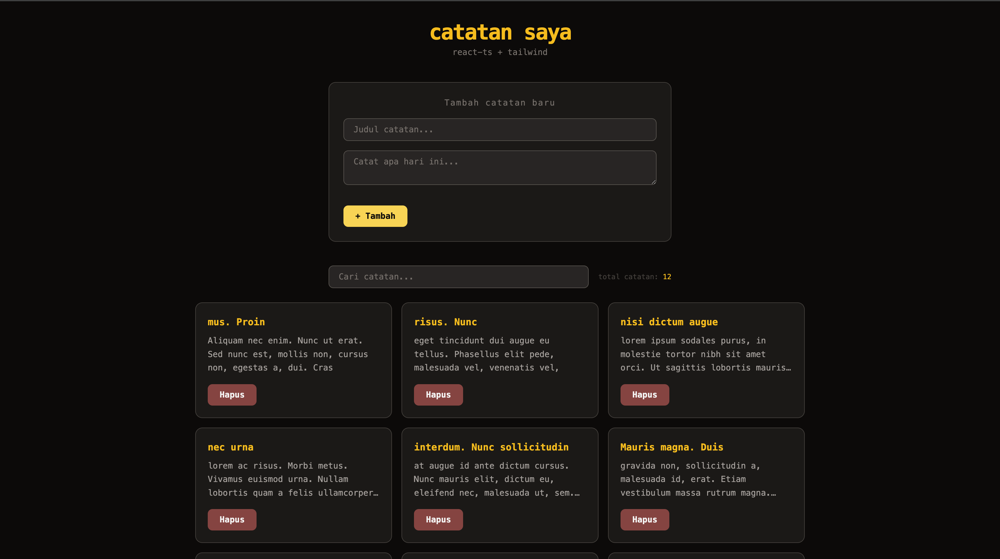

# 📝 catatan-saya

Aplikasi catatan sederhana yang dibangun sebagai latihan pertama menggunakan **React + TypeScript + Tailwind CSS**.



---

## ✨ Fitur

-   Tambah catatan baru dengan judul dan isi
-   Hapus catatan
-   Search/filter catatan berdasarkan judul (real-time)
-   Menampilkan total catatan yang sedang ditampilkan
-   Data tersimpan secara permanen di localStorage

---

## 🚀 Cara Install & Run

```bash
# Clone repo
git clone https://github.com/username/catatan-saya.git
cd catatan-saya

# Install dependencies
npm install

# Jalankan dev server
npm run dev
```

Buka [http://localhost:5173](http://localhost:5173) di browser.

---

    Yang saya pelajari:

-   UseState dan UseEffect
-   Memecah jadi beberapa components
-   Membuat custom hooks
-   Implementasi localStorage dengan initialize function untuk data initial

---

## 🛠 Tech Stack

-   [React](https://react.dev/) + [TypeScript](https://www.typescriptlang.org/)
-   [Tailwind CSS](https://tailwindcss.com/)
-   [Vite](https://vitejs.dev/)

---
